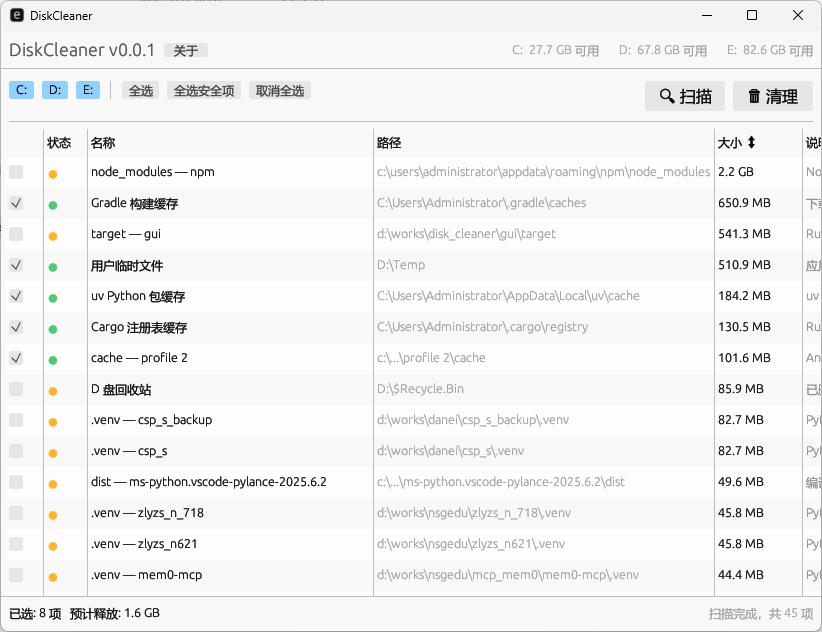

# DiskCleaner

跨平台磁盘清理工具（Windows + Android），智能扫描并清理系统垃圾文件。Windows 版单文件 5MB，开箱即用。



## 功能特点

- **116+ 清理目标**：覆盖系统临时文件、浏览器缓存、包管理器、IDE 缓存、通讯软件等
- **安全分级**：🟢 安全删除 / 🟡 需确认 两级标记，防止误删
- **极速扫描**：搭配 Everything 仅需 ~5 秒；无 Everything 约 30 秒
- **磁盘缓存**：重启应用秒开，无需重新扫描
- **自定义目标**：支持外置 JSON 配置文件扩展清理规则
- **单实例保护**：重复打开自动激活已有窗口
- **跨平台支持**：原生支持 Windows (x86_64) 与 Android (arm64-v8a)

## 快速开始

### 便携版（推荐）

1. 下载最新 [Release](https://github.com/mosjin/DiskCleanerSimple/releases)
2. 双击 `Start.bat`（自动启动 Everything + DiskCleaner）
3. 选择要清理的项目 → 点击「清理」

### Android 版
### Android 版

1. 下载最新 [v0.0.3 APK](https://github.com/mosjin/DiskCleanerSimple/releases/download/v0.0.3/DiskCleaner-v0.0.3.apk)
2. 安装到 Android 手机
3. 启动并授予「所有文件访问」权限
4. 开始扫描与重复文件检测

### 手动运行

直接双击 `DiskCleaner.exe` 即可运行。

> 搭配 [Everything](https://www.voidtools.com/) 可获得最佳扫描性能（~5s vs ~30s）。

## 目录结构

```
DiskCleaner/
├── DiskCleaner.exe          # 主程序（5MB 单文件）
├── Start.bat                # 启动脚本（自动启动 Everything）
├── config/
│   └── custom_targets.example.json  # 自定义清理规则示例
└── Everything/              # Everything 便携版（可选）
    ├── Everything.exe
    ├── Everything.ini
    └── Everything.lng
```

## 自定义清理目标

将 `custom_targets.json` 放在 `DiskCleaner.exe` 同级目录下：

```json
{
  "targets": [
    {
      "name": "我的缓存",
      "paths": ["D:\\MyApp\\cache"],
      "mode": "contents",
      "safety": "safe",
      "desc": "自定义应用缓存"
    }
  ]
}
```

| 字段 | 必填 | 说明 |
|------|------|------|
| `name` | 是 | 显示名称 |
| `paths` | 是 | 目标路径（支持 `%ENV_VAR%` 环境变量） |
| `mode` | 否 | `contents`（默认）/ `directory` / `glob` |
| `safety` | 否 | `safe`（默认）/ `review` |
| `desc` | 否 | 描述文字 |

完整示例见 [`docs/custom_targets.example.json`](docs/custom_targets.example.json)

## 系统要求

- **Windows**: Windows 10 / 11（64-bit）
- **Android**: Android 8.0+ (API 26+), 推荐 ARM64 设备

## 关于作者

| | |
|---|---|
| 视频号 | **小宁静致远** |
| 公众号 | [**小宁静致远**](https://mp.weixin.qq.com/s/VUZptCjXVfCmaocEQTOLAw) |
| 知识星球 | [**新人类**](https://wx.zsxq.com/group/15555585121222) |
| 个人微信 | **mosjin**（暗号: 新人类） |
| 个人网站 | [jinLab.com](https://jinLab.com) |

## 新人类体验群

扫码加入体验群，获取最新版本、反馈问题、交流使用心得：


## 赞赏

如果 DiskCleaner 帮到了你，欢迎赞赏支持：


## License

MIT
